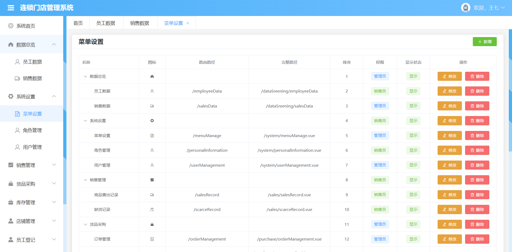
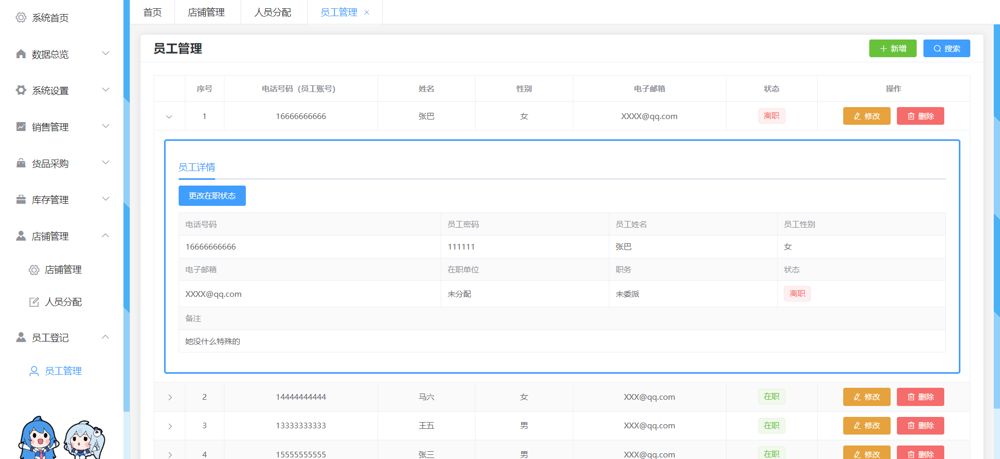
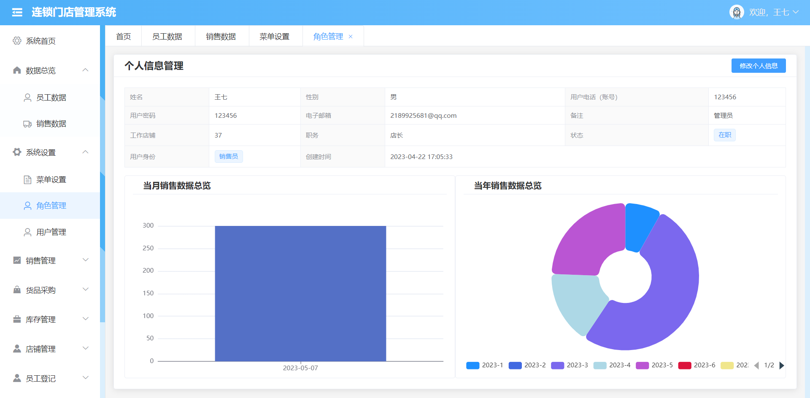
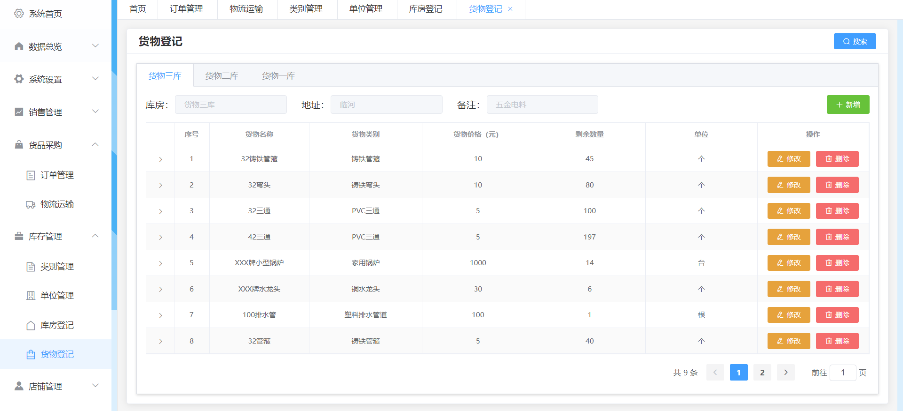
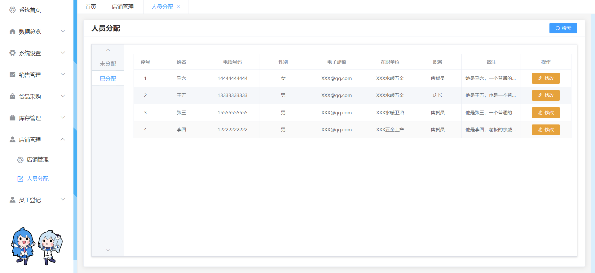
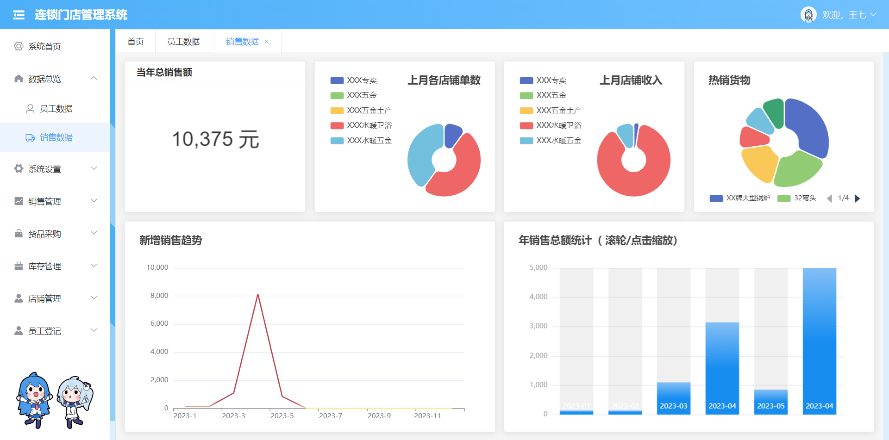

### 基于springboot的类超市管理系统
前后端分离
#### 技术：

vue2 + elementui + echars，datav

##### install dependencies
```
npm install
```
##### serve with hot reload at localhost:8080
```
npm run serve
```
### 功能图







