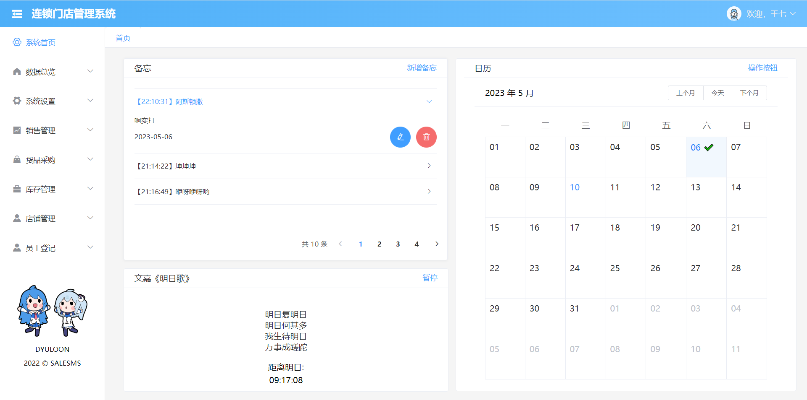

### 基于springboot的类超市管理系统
在超市管理中引进现代化的 办公软件 ，实现超市庞大商品的控制和传输，从而方便销售行业的管理和决策，为超市和超市管理人员解除后顾之忧。一款好的超市 销售管理系统 ，应该是可以帮助销售部门提高工作效率，帮助超市工作人员利用计算机，极为方便的对超市的有关数据进行管理、输入、输出、查找等有关操作，使杂乱的超市数据能够具体化、直观化、合理化等。

#### 技术：
前后端分离

vue2 + elementui + echars，datav

##### install dependencies
```
npm install
```
##### serve with hot reload at localhost:8080
```
npm run serve
```
### 功能图




